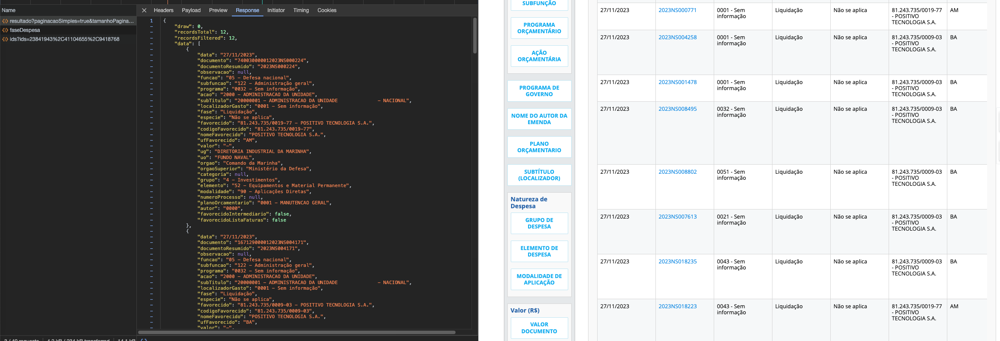

# Crawl
Esta área está destinada a alguns passos para rodar o crawl e gerar novas spiders para realizar crawl

## Rodar Crawl
Para rodar crawl é necessário saber apenas o nome da spider e os comandos.
Caso a spider espere por comandos utilizar os atríbutos correspondeste. Rode o comando a seguir para mais opções:
```bash 
scrapy crawl -h
```
Para rodar uma spider pode seguir o exemplo:
```python
scrapy crawl portaldatransparencia -a date="27/11/2023"
```
O parametro `date` espera uma data no formato "DD/MM/YYYY". Onde é a data de liquidação que deseja.

## Passos para gerar novo crawl para captura de dados de outro portal
### Scrapy
- O framework [Scrapy](https://scrapy.org/) apresenta uma [arquitetura](https://docs.scrapy.org/en/latest/topics/architecture.html) otimizada e própria para extração de dados.
- Para gerar uma nova [spider](https://docs.scrapy.org/en/latest/topics/spiders.html) para realizar extração de dados nos padrões do framework rode o comando:
```python
scrapy genspider <name> <domain or URL>
```
- Deve ser gerado um arquivo com o nome da Spider e estrutura inicial com endereço principal de onde irá partir a navegação do crawl.
- É importante seguir [boas práticas](https://docs.google.com/document/d/1h0IWG4yPeqcmtZpr-ahttIoMJLlHCHiWHJcZXnmXZZE/edit?usp=sharing) para não ocorrer block do IP de onde o crawl é executado.

### Extração de dados
A primeira etapa para extração de dados é conhecer os dados que deseja extrair. Como estão organizados e disponibilizados. É necessário realizar um estudo da página, e possivelmente das páginas internas que possam conter mais dados necessários para extração. Cada página contém estrutura única que deve ser conhecida.

No caso do site https://portaldatransparencia.gov.br é possível notar a presenção de endpoints abertos para consulta de dados, assim como o dowload das páginas para captura de dados necessários.

Um primeiro passo é checar se os endpoints contém os dados necessários:


Caso não contenha todos os dados realziar o download e leitura da estrutra da página para extração dos dados.

### Load de dados
Após a extração de dados é necessário armazenar em algum ambiente.
Neste projeto está sendo armazenado arquivos em `.json` para teste de store em Data Lake.

